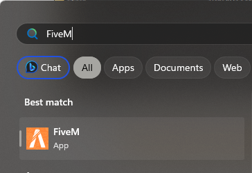

# Clearing your game cache

Sometimes it might be nescessary to clear your game cache. This can help with stuttering/lag issues, headaches and is it good practice to do every so often to keep your game clean. Support will advise if you need to clear your cache, but we recommend doing this around once a month or if you have not flown in to city for a while.

To start you do not need to be a technical expert to do this. You also need to have <mark style="color:red;">**FiveM CLOSED**</mark> for this

* Open your start menu and search for <mark style="color:red;">**FiveM**</mark> > <mark style="color:red;">**Right click**</mark> and press <mark style="color:red;">**"Open file location"**</mark>

<figure><figcaption></figcaption></figure>

* You may need to then right click again on the FiveM icon and click "Open File Location"

.png>)&#x20;

* Navigate to <mark style="color:red;">**"FiveM Application Data"**</mark>

<figure><figcaption></figcaption></figure>

* Find the <mark style="color:red;">**Data**</mark> folder and open it up

<figure><figcaption></figcaption></figure>

* You now need to select (press and hold CTRL and click on the folders) <mark style="color:red;">**cache, server-cache, server-cache-priv**</mark><mark style="color:red;">.</mark>&#x20;

<figure><figcaption></figcaption></figure>

* Now let go of CTRL and press delete (You can also right click and press delete) you may get a prompt asking you to confirm, click yes.

Now load up FiveM again and join the RusticRP server. The first time you load back in it may take longer than normal, you may also find that some vehicles and objects do not load in straight away. This will fix it's self as the cache updates and the files download from the server.

